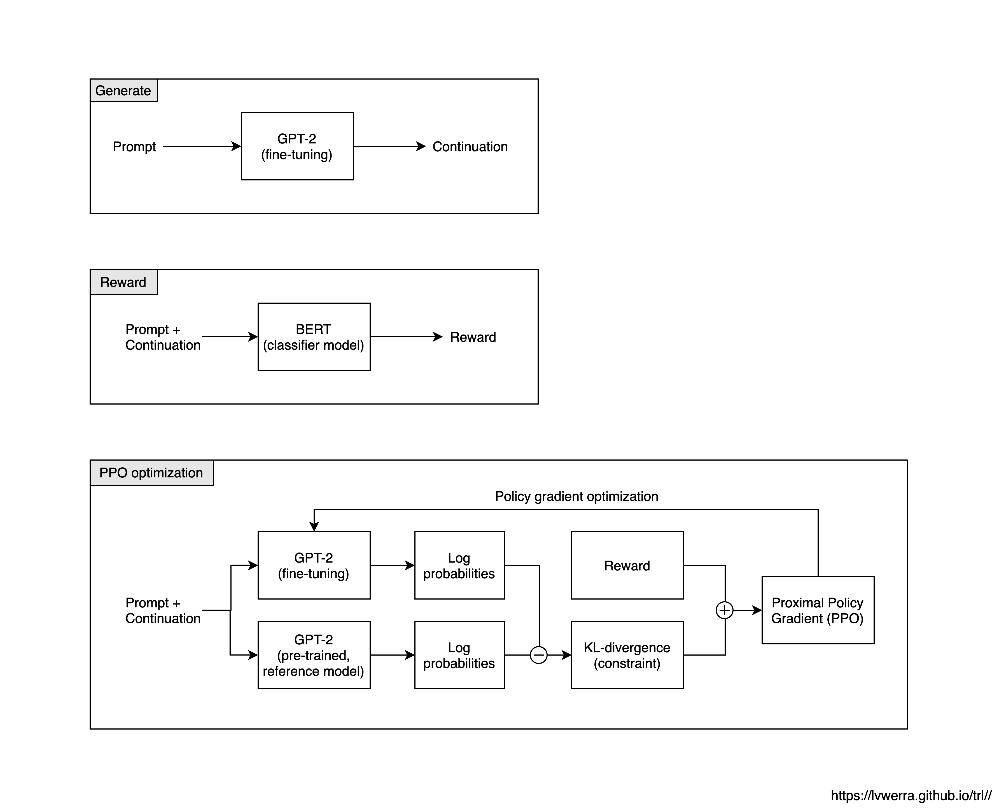

# Team Working Agreements

## Logistics

Work room: 

Meeting times: Monday, Wednesday, Saturday 9 pm

Project repository: https://github.com/chrisliu298/tapt

Communication channel: https://ucsc.zoom.us/j/7502416519

## Development Environment

Deep learning libraries: PyTorch, HuggingFace Transformers

Development tools/IDE: GitHub, VSCode

Developemnt environment: Google Colab, Google Cloud Platform, Paperspace

Hardware: Nvidia Quadro P6000, Nvidia Tesla P100/V100, Cloud TPU

Project management tools: Jira Scrum Board, GitHub

## Coding Style/Standards

[Google Python Style Guide](https://google.github.io/styleguide/pyguide.html)

## Work (Process) Patterns

**Definition(s) of done**

Code: carefully written and tested

Model: trained and evaluated

**Areas of resposibility**

-   Data preprocessing
-   Model training
-   Data generation
-   Data evaluation

**Collaboration with experts**

-   Professor Jeffrey Flanigan (minor advice accpeted)

## Product Design Patterns

**Problems (Ziegler et al., 2019)**

-   Unavailable or insufficient supervised datasets
-   Uncontrolled generation is undesirable because the true goal is not specified

**Previous works**

-   Augment text data using autoregressive Transformers with weak control signal (Kumar et al., 2020)
-   Fine-tune GPT-2 using reinforcement learning so that the generating policy is optimized toward a goal (Ziegler et al., 2019)

**Our approach**

-   GPT-2 + BERT + PPO = controlled text augmentation (by generation) with a strong signal

**Product architecture**

**Components**

-   GPT-2 model
-   BERT model
-   Classifier module
-   Generator module
-   Data preprocessing pipeline
-   Training scripts
-   Other utility functions

## References

-   Brown, Tom B., et al. "Language models are few-shot learners." arXiv preprint arXiv:2005.14165 (2020).
-   Devlin, Jacob, et al. "Bert: Pre-training of deep bidirectional transformers for language understanding." arXiv preprint arXiv:1810.04805 (2018).
-   Kumar, Varun, Ashutosh Choudhary, and Eunah Cho. "Data augmentation using pre-trained transformer models." arXiv preprint arXiv:2003.02245 (2020).
-   Kurita, Keita, Paul Michel, and Graham Neubig. "Weight poisoning attacks on pre-trained models." *arXiv preprint arXiv:2004.06660* (2020).
-   Radford, Alec, et al. "Language models are unsupervised multitask learners." OpenAI Blog 1.8 (2019): 9.
-   Schulman, John, et al. "Proximal policy optimization algorithms." arXiv preprint arXiv:1707.06347 (2017).
-   Vaswani, Ashish, et al. "Attention is all you need." Advances in neural information processing systems. 2017.
-   Ziegler, Daniel M., et al. "Fine-tuning language models from human preferences." arXiv preprint arXiv:1909.08593 (2019).