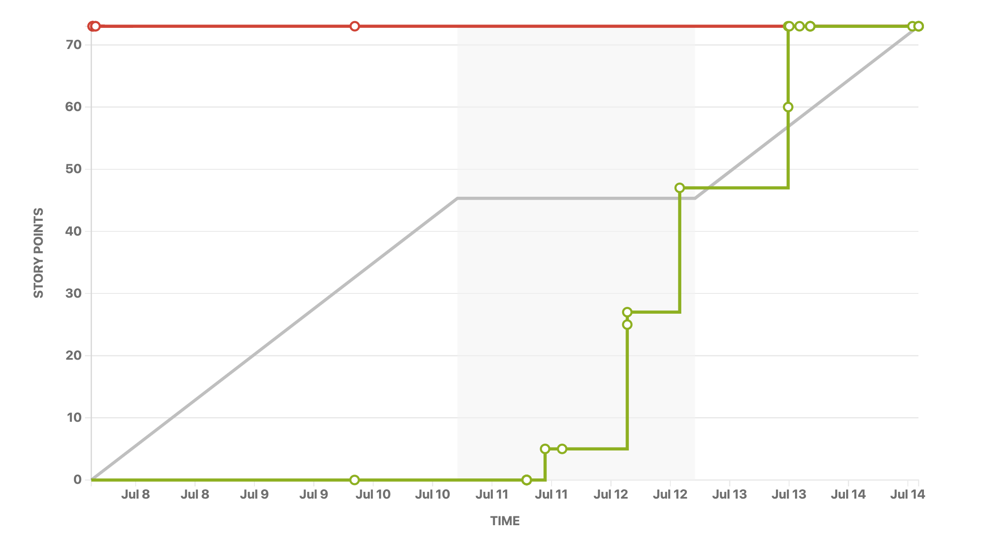

# Sprint 2 Report

Product name: TAPT

Team name: TFRL

Date: 7/14/20

## Actions to stop doing:

- The team should stop assign ambiguous tasks, because assigning substantive and clear tasks help team members to better understand the workload and to know where to start.
- The team should stop starting working without resolving Spike, because this decreased the efficiency and caused unable to finish tasks on time.

## Actions to start doing:

-  The team should write comments when refactor because we can reduce the later workload.
-  The team get familer with Goolge python style guide because we can write clear and organized code.

## Actions to keep doing:

- Our team want to keep meeting frequently to track the progress.
- Our team want to keep evaluating the model to ensure the feasibility of the algorithm.

## Work completed/not completed:

We completed all the user stories in our second version of sprint 2 plan, including:

- As a researcher, I want to set up the training loop of GPT-2 with PPO training so that it can do controlled generation (IMDb).
- As a researcher, I want to come up with multiple sets of possible hyperparameters so that I can test which set works the best (IMDb).
- As a researcher, I want to fine-tune the GPT-2 model using PPO training so that it can serve as the core data augmentation model (IMDb).
- As a researcher, I want to perform the language modeling task using the GPT-2 model so that I can use it for weak-signal controlled generation task (Yelp polarity).
- As a researcher, I want to use a fine-tuned BERT-like model so that I can use it as a supervisor of my GPT-2 generator during PPO training (Yelp polarity).
- As a researcher, I want to set up the training loop of GPT-2 using PPO training so that I can fine-tune it with reward learning (Yelp polarity).

## Work completion rate:

- Total number of user stories completed: 6
- Total number of estimated ideal work hours: 
  1. Coding: 6hrs
  2. Training: 48hrs
- Total number of days: 7
- 
